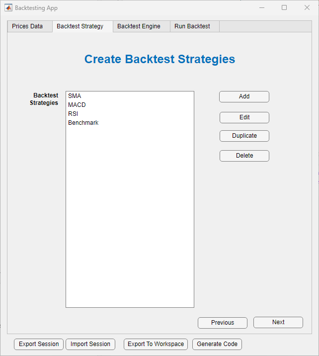
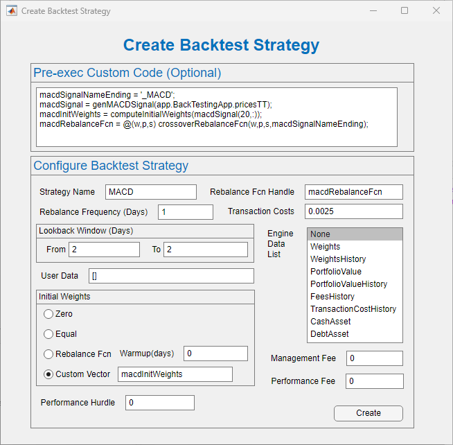
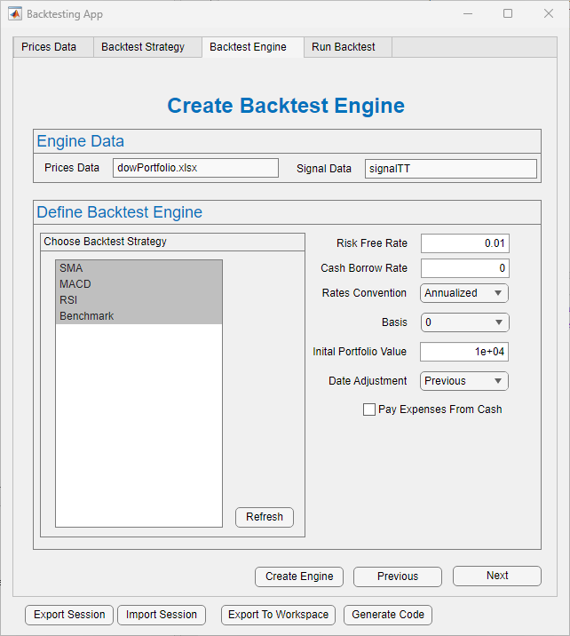
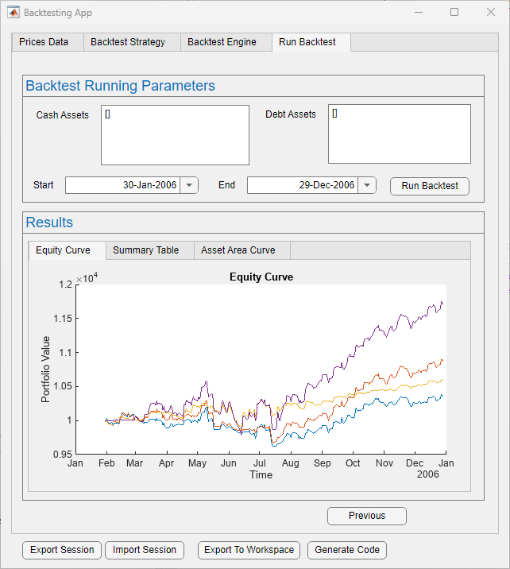

## Portfolio Backtesting Application

Application to create and run backtest strategies. This application aims to provide a GUI for the BacktestStrategy, BacktestEngine and runBacktest APIs. 
The pain point for the APIs currently is that there is no dashboard to easily view the backtest strategies and engine parameters. 

## Getting Started
Download or clone this repository to your machine and open it in MATLAB®.

# Setup
Right-click on the "ExampleFiles" folder and select "Add to Path" and subsequently "Selected Folders" before following any of the setup options below.

There are three ways to setup and launch the application:

1. App Designer  
    1.1. Double-click the BacktestingApp.mlapp file. The App Designer will load in a new window.  
    1.2. Click on the "Run" button in the toolstrip of the App Designer to load the Backtesting App.      

2. Command Window  
    2.1. Type in "BacktestingApp" into the Command Window to load the Backtesting App.    

3. App Installation   
    3.1. Double-click the BacktestingApp.mlapp file. The App Designer will load in a new window.  
    3.2. Click on the "Share" button of the App Designer toolstrip and select "MATLAB App". The Package App functionality will load in a new window.  
    3.3. Click on the "Package" button on the right-hand side of the window and return to MATLAB. A file entitled "Backtesting App.mlappinstall" should be present.  
    3.4. Double-click on "Backtesting App.mlappinstall" and click on the "Install" button when prompted.  
    3.5. On the MATLAB toolstrip, go to the "APPS" tab and click on the drop down arrow.   
    3.6. Under "MY APPS", select the Backtesting App to load the application.  

Requires:
* Financial Toolbox™

## Workflow and Features
1. Import Data Module:  
    1.1. Import prices data directly from Excel sheet, .mat file or choose existing timetable from MATLAB workspace.  
    1.3. Optionally, import signal data directly from Excel sheet, .mat file or choose existing timetable from MATLAB workspace.    

2. Create Backtest Strategies:  
    2.1. In the main window, there is a tab showing the list of created backtest strategies  
        2.1.1.Text box shows list of backtest strategies created using application.  
        2.1.2. Add button: Add a brand new strategy.  
        2.1.3. Edit button: Edit existing strategy.  
        2.1.4. Duplicate button: Create a copy of existing strategy and simply modify their fields to create a new one.  
        2.1.5. Delete button: Delete an existing strategy.  
      
    2.2. Window 2B is launched in a different pane.  
        2.2.1. Default values from BacktestStrategy objects are pre populated.  
        2.2.2. If you choose to edit/duplicate a value, all fields will be populated from the selected strategy.  
        2.2.3. The Pre-exec text box on top executes MATLAB code before creating the BacktestStrategy object. This allows the user to compute any values/variables/function-handles before using them in the other fields.  
    
3. Create Backtest Engine:  
    3.1. With the imported data, create a backtest engine by selecting the strategies to consider and parameter values chosen.  
    3.2. The Prices and Signal data fields are un-editable and are only to inform of the data being worked on.

4. Run Backtest:  
    4.1. Choose the start and end dates for backtest to run in.  
    4.2. Optionally add an array of strings with the names of the cash assets and the names of the debt assets.  
    4.3. Upon running, find Equity Curve, Summary Table and Asset Area Curves plotted in different tabs.  

5. Use Export to Workspace button to export BacktestStrategy and BacktestEngine objects to 'base' workspace. This creates a new structure named backtestingStruct that has the backtest strategies and engine as its fields.  
6. Use Export Session and Import Session buttons to export application state as a appSession variable. Save this variable as mat file to import session later.
7. Click Generate Code button to generate code for importing data, creating backtest strategies, backtest engine and then running the backtest.

## Examples
1. [Backtest Investment Strategies Using Financial Toolbox](https://www.mathworks.com/help/finance/backtest-investment-strategies.html): Open application, choose to import session and select ExampleFiles/Example1Session.mat
2. [Backtest Investment Strategies with Trading Signals](https://www.mathworks.com/help/finance/backtest-investment-strategies-with-trading-signals.html): Open application, choose to import session and select ExampleFiles/Example2Session.mat

## Files
1. **ExampleFiles/. :** This directory contains MATLAB functions representing different reblancing functions for different backtesting strategies.
2. **WorkflowImages/. :** This directory is houses images that are used for the documentation/demos.
3. **BacktestingApp.mlapp:** Primary application is implemented in this file. 
4. **CreateStrategyApp.mlapp:** This application is spawned from the primary application as a new window. This window's purpose is to solely maintain individual backtesting strategies.

## Version History
- **V1** Does not support importing data
- **V1.1** Import data module added along with buttons for navigating through tabs. 
- **V1.2** Added optional Name-Value arguments to BacktestEngine, BacktestStrategy and runBacktest and option to export BacktestStrategies and BacktestEngine
- **V1.3** Added option to export application session state
- **V1.4** Added option to import application session state
- **V1.5** Added provision to sort and transpose backtest summary table
- **V1.6** Added support and examples for signal data
- **V1.7** Added feature to generate code for importing data, creating backtest strategy, creating backtest engine and running backtest
- **V1.8** Modified/extended data import capabilities to work with workspace variables

## Possible Improvements:
1. When creating a backtest strategy object, make the “Pre-Exec” code block foldable.
2. When importing data, add provision to cleanup data. Can explore merging MATLAB [Data Cleaner](https://www.mathworks.com/help/matlab/ref/datacleaner-app.html) app.

## License
The license is available in the License.txt file in this GitHub repository.

## Contact
Naman Bhaia at nbhaia@mathworks.com, Engineering Development and developer of the app

Sara Galante at sdavis@mathworks.com, Application Engineering

Copyright 2024 The MathWorks, Inc.
